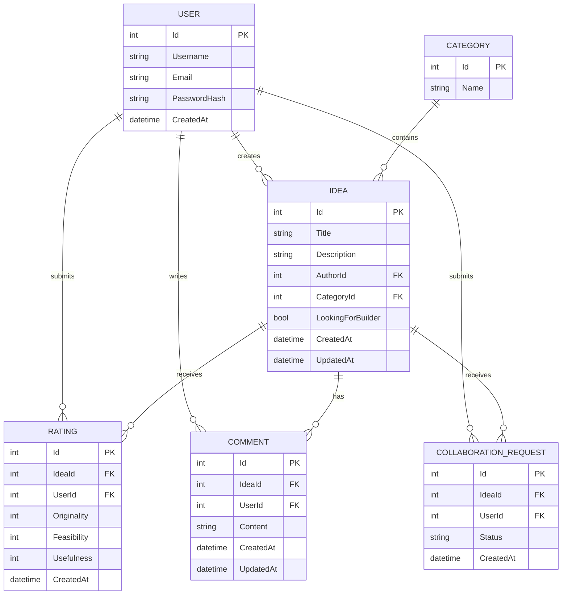

# Ideon Database Design

## Overview

The Ideon database stores users, idea categories, ideas, ratings, comments, and collaboration requests.

## Tables

### User

| Field | Type |
|---|---|
| Id | int |
| Username | string |
| Email | string |
| PasswordHash | string |
| CreatedAt | datetime |

### Category

| Field | Type |
|---|---|
| Id | int |
| Name | string |

### Idea

| Field | Type |
|---|---|
| Id | int |
| Title | string |
| Description | string |
| AuthorId | int |
| CategoryId | int |
| LookingForBuilder | bool |
| CreatedAt | datetime |
| UpdatedAt | datetime |

### Rating

| Field | Type |
|---|---|
| Id | int |
| IdeaId | int |
| UserId | int |
| Originality | int |
| Feasibility | int |
| Usefulness | int |
| CreatedAt | datetime |

### Comment

| Field | Type |
|---|---|
| Id | int |
| IdeaId | int |
| UserId | int |
| Content | string |
| CreatedAt | datetime |
| UpdatedAt | datetime |

### CollaborationRequest

| Field | Type |
|---|---|
| Id | int |
| IdeaId | int |
| UserId | int |
| Status | string |
| CreatedAt | datetime |

## Relationships

| Relationship | Description |
|---|---|
| User 1 → * Idea | A user can create multiple ideas. Each idea has one author. |
| Category 1 → * Idea | A category can contain multiple ideas. Each idea belongs to one category. |
| User 1 → * Rating | A user can create multiple ratings. Each rating belongs to one user. |
| Idea 1 → * Rating | An idea can have multiple ratings. Each rating belongs to one idea. |
| User 1 → * Comment | A user can write multiple comments. Each comment belongs to one user. |
| Idea 1 → * Comment | An idea can have multiple comments. Each comment belongs to one idea. |
| User 1 → * CollaborationRequest | A user can submit multiple collaboration requests. Each request belongs to one user. |
| Idea 1 → * CollaborationRequest | An idea can receive multiple collaboration requests. Each request belongs to one idea. |

## Foreign Keys

| Table | Field | References |
|---|---|---|
| Idea | AuthorId | User.Id |
| Idea | CategoryId | Category.Id |
| Rating | IdeaId | Idea.Id |
| Rating | UserId | User.Id |
| Comment | IdeaId | Idea.Id |
| Comment | UserId | User.Id |
| CollaborationRequest | IdeaId | Idea.Id |
| CollaborationRequest | UserId | User.Id |

## Entity Relationship Diagram

## Notes

- `User.Id`, `Category.Id`, `Idea.Id`, `Rating.Id`, `Comment.Id`, and `CollaborationRequest.Id` are primary keys.
- `Idea.AuthorId` identifies the user who created the idea.
- `Idea.CategoryId` identifies the category assigned to the idea.
- `Rating` connects users with ideas and stores three evaluation scores.
- `Comment` connects users with ideas and stores discussion content.
- `CollaborationRequest` records a user's request to collaborate on an idea.
- `Status` can contain values such as `Pending`, `Accepted`, or `Rejected`.
